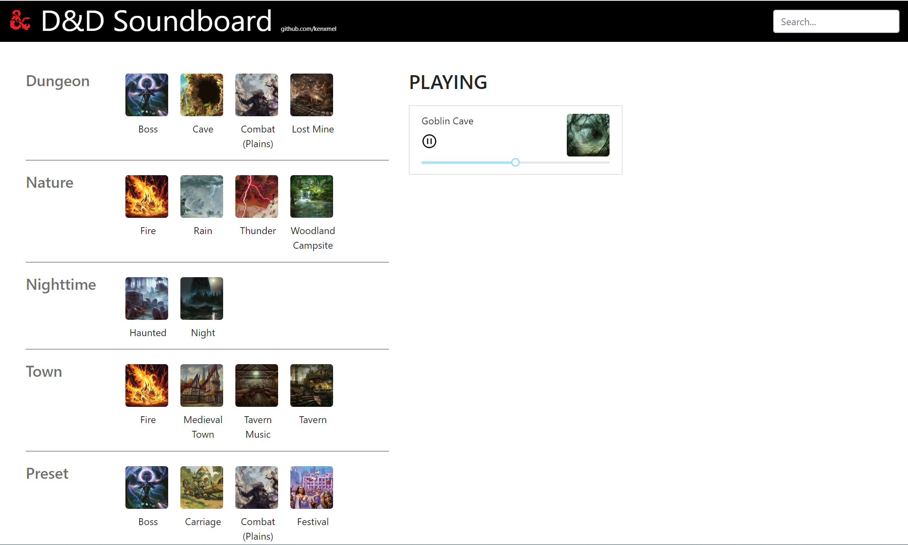

# dnd-soundboard

Soundboard for role-playing game, D&amp;D developed in ReactJS with UI supported by Bootstrap.

Users are able to mix and match different combination of sounds to produce the desired ambient sound. Audio is rendered dynamically to drastically reduce load times.

---

# Credit
[`rc-slider`](//github.com/schrodinger/rc-slider)  
[Boss + Carriage + Combat(Plains) + Festival + Goblin Cave + Haunted + Lost Mine + Medieval Town + Tavern + Woodland Campsite](//tabletopaudio.com)
